# Estadísticas NBA

> Francisco Javier Bolívar Lupiáñez

## Introducción

El baloncesto es un deporte donde se pueden rescatar, más fácilmente que en otros deportes de equipo como el fútbol, las estadísticas individuales y relevantes de cada jugador pero el uso que se hacen de ellas es muy pobre pues en la mayoría de las webs solo acaban mostrando quiénes son los jugadores que más puntos, rebotes y asistencias por partido hacen.

Es por ello que vemos en este un buen campo para realizar minería de datos, por lo que el *dataset* escogido ha sido el de las estadísticas individuales de cada jugador durante la temporada 2012/2016.

### *Dataset*

El *dataset* escogido contiene las estadísticas de los 476 jugadores que jugaron durante la temporada 2015/2016 algún partido en la NBA. Las estadísticas cuentan con los siguientes datos:

* *Player*: Nombre del jugador
* *Team*: Iniciales del equipo donde juega
* *PS*: Posición en la que juega. Puede ser:
  * *PG*: Base (*point guard*)
  * *SG*: Escolta (*small guard*)
  * *SF*: Alero (*small forward*)
  * *PF*: Ala-pívot (*power forward*)
  * *C*: Pívot (*center*)
* *GP*: Partidos jugados
* *Min*: Minutos jugados
* *FGM*: Tiros de campo anotados
* *FGA*: Tiros de campo intentados
* *3M*: Tiros de tres anotados
* *3A*: Tiros de tres intentados
* *FTM*: Tiros libres anotados
* *FTA*: Tiros libres intentados
* *OR*: Rebotes ofensivos
* *TR*: Rebotes
* *AS*: Asistencias
* *ST*: Robos
* *TO*: Pérdidas
* *BK*: Bloqueos
* *PF*: Faltas personales
* *DQ*: Descalificaciones
* *PTS*: Puntos
* *TC*: Faltas técnicas
* *Sta*: Partidos comenzados desde el quinteto inicial
* *+/-*: Balance de puntos a favor o en contra del equipo mientras el jugador está en el campo

Todos los datos son números enteros a excepción del nombre del jugador, el equipo y la posición que son cadenas de caracteres.

## Minería de datos

Hemos decidido realizar el trabajo utilizando la herramienta KNIME debido a que es sencilla de utilizar y ofrece una retroalimentación visual que nos permite ver el espacio de trabajo de forma directa.

### Pre-procesamiento de datos

La primera fase será la de realizar un pre-procesado de los datos mediante técnicas de estadística descriptiva con el objetivo de conocer nuestro *dataset* para poder realizar posteriormente otras tareas.

#### Datos estadísticos

Usando el nodo *statistics* de KNIME directamente sobre nuestro *dataset* podemos realizar un primer vistazo a nuestros datos.

Con este podemos ver para cada columna el valor mínimo, máximo, media, desviación típica, asimetría estadística, curtosis, datos perdidos, datos con valor infinito y un histograma con las repeticiones de cada valor.

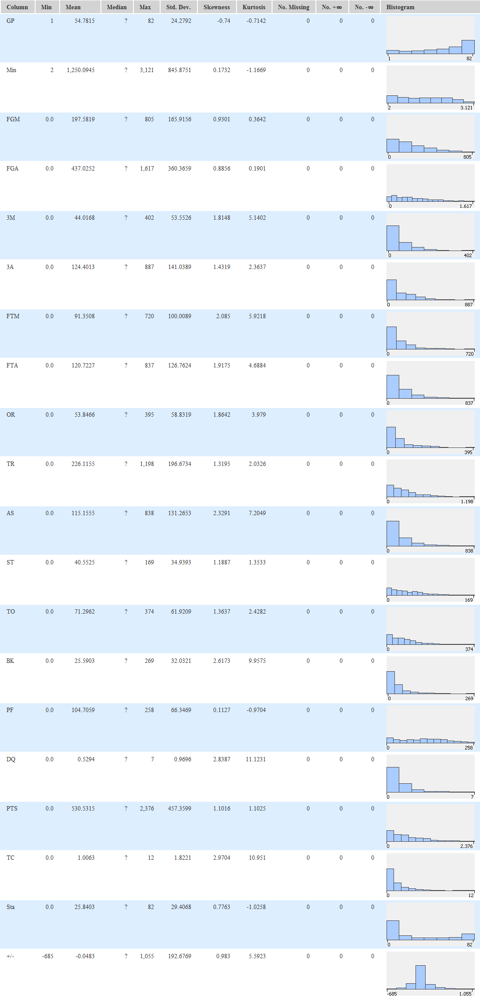

Aquí ya podemos observar como datos como tiros intentados y tiros anotados (de campo, de tres y libres) tienen bastante parecido y como muchas columnas tienen una enorme asimetría probablemente provocada por la diferencia que hay entre los que juegan muchos minutos y los que juegan pocos ya que a más minutos se jueguen mayor será la cantidad de puntos, rebotes o asistencias realizadas. Esto nos puede llevar a empezar a pensar en que una columna puntos, asistencias, rebotes... por minuto sea mucho más significativa para realizar comparaciones. Siempre teniendo en cuenta que a más minutos juega un jugador es porque, supuestamente, es más bueno.

#### Diagrama de cajas

A continuación vamos a ver los diagramas de cajas de cada una de las columnas usando el nodo *box plot* de KNIME.

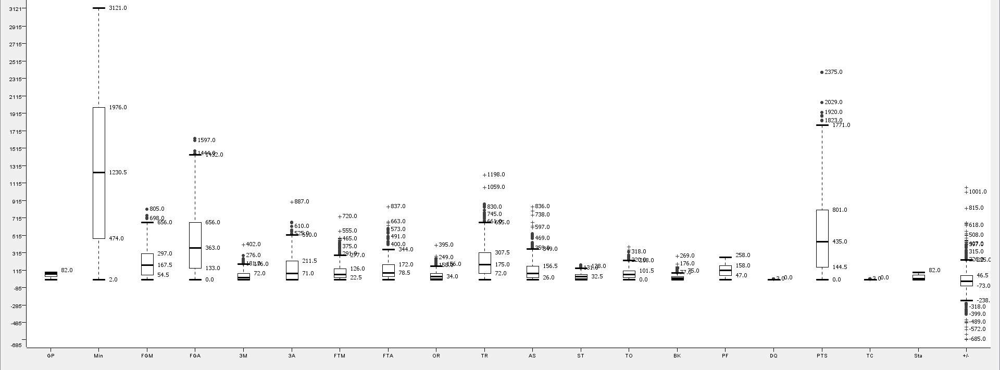

Las sospechas de lo desequilibradas que podrían estar algunas de las columnas se ven despejadas con este diagrama donde vemos que la mayoría de los datos están muy desequilibrados ya que casi todos tienen su mínimo en cero (algún jugador que haya jugado muy pocos minutos y no ha podido sumar en su casillero personal de esa estadística) y muchos que despuntan por arriba (aquellos que juegan muchos minutos y además los rentan con buenos números).

#### Correlación linear

Algunos datos podrían ser eliminados o sustituidos por otros. Ya hemos visto que los minutos influyen mucho en el resto de estadísticas. Con la matriz de correlación lo vamos a ver más claramente:

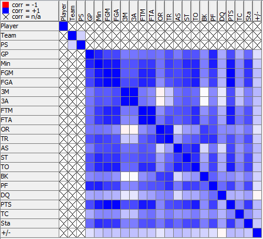

Efectivamente vemos como la columna de los puntos se ve tremendamente influenciada con los minutos alcanzando una correlación cercana a uno y a su vez influye en puntos de campo intentados y anotados.

También hay una relación enorme entre tiros intentados y anotados (tanto de campo, como de tres, como libres), por lo que podría ser una buena idea cambiar la columna de tiros intentados por porcentaje de acierto que nos puede dar más información.

Y no solo los puntos se ven influenciados por los minutos. Otro dato que, lógicamente, se ve afectado es el de partidos jugados, a más partidos juegas más minutos y viceversa y como los minutos es un datos más preciso que los partidos se podría prescindir de este dato ya que también tenemos el número de partidos que se empiezan desde el quinteto con el que podemos obtener los jugadores más buenos (que suelen salir de inicio).

**CONCLUSIÓN:** Vamos a modificar las siguientes columnas del *dataset*:

* Partidos jugados será borrado por su enorme relación con los minutos.
* Tiros de campo anotados e intentados serán borrados por su enorme relación con los puntos.
* Tiros de tres anotados por tiros de tres anotados por minuto.
* Tiros de tres intentados por porcentaje de acierto en tiros de tres.
* Tiros libres anotados por tiros libres por minuto.
* Tiros libres intentados por porcentaje de acierto en tiros libres.
* Rebotes ofensivos será borrado por su enorme relación con los rebotes.
* Rebotes por rebotes por minuto.
* Asistencias por asistencias por minuto.
* Robos por robos por minuto.
* Pérdidas por pérdidas por minuto.
* Bloqueos por bloqueos por minuto.
* Faltas personales por faltas personales por minuto.
* Puntos por puntos por minuto.
* Partidos de inicio será borrado por su enorme relación con los minutos.

También eliminaré aquellas filas con jugadores que hayan jugado menos de 100 minutos ya que pueden haber jugado tan pocos que todos los tiros que hayan hecho los hayan metido y salgan como si hubiesen hecho mucho aunque en realidad apenas han aportado porque han jugado poco. Con este filtro se ha pasado de las 476 filas iniciales a 431.

La matriz de correlación con los nuevos datos es la siguiente:

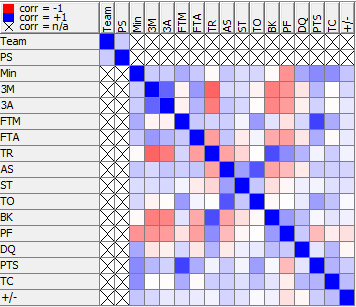

Donde ya no se ven relaciones tan fuertes entre variables.

#### Diagrama de cajas

Mediante *box plot* agrupando por posiciones vamos a ver si algún dato tiene relación con alguna posición en particular para tenerlo en cuenta posteriormente a la hora de realizar agrupaciones.

##### Tiros de 3 anotados

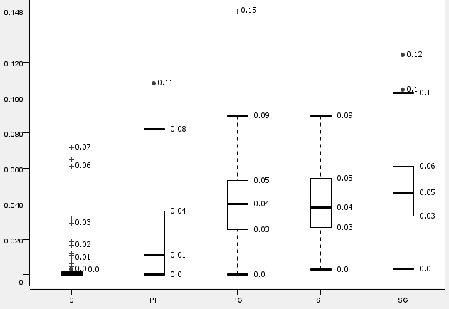

Aquí se puede observar como los pívot apenas anotan tiros de tres salvo casos aislados. Los ala-pívot tampoco suelen anotar mucho. Mientras que los bases, escoltas y aleros suelen anotar más o menos por igual.

##### Porcentaje tiros de 3

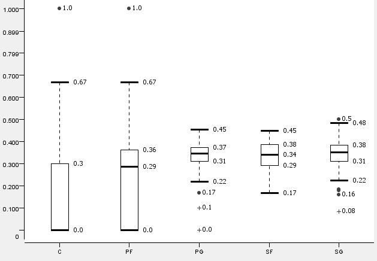

En cuanto al porcentaje, muchos pivots y ala-pívots ni siquiera tiran y los que tiran lo hacen con un porcentaje muy bajo salvo casos aislados. Al igual que con los anotados, las otras tres posiciones siguen más o menos el mismo comportamiento.

##### Tiros libres anotados

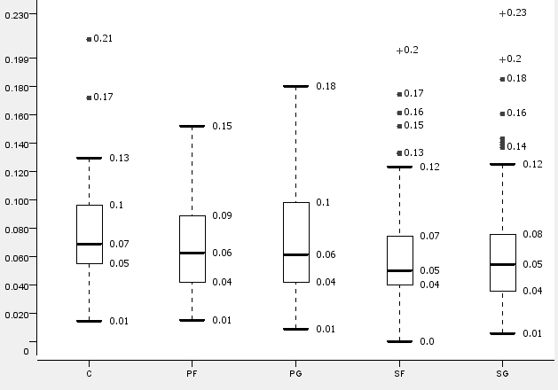

En este dato el comportamiento por posición no varía mucho. Si anotan tiros libres es porque les hacen faltas, lo cual indica que no se cometen faltas sobre jugadores de un puesto en particular.

##### Porcentaje tiros libres

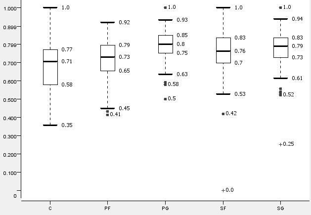

En cuanto al porcentaje de aciertos desde la línea de personal, los pívots son los peores tiradores y los bases los mejores, pero no difieren tanto los unos de los otros.

##### Rebotes

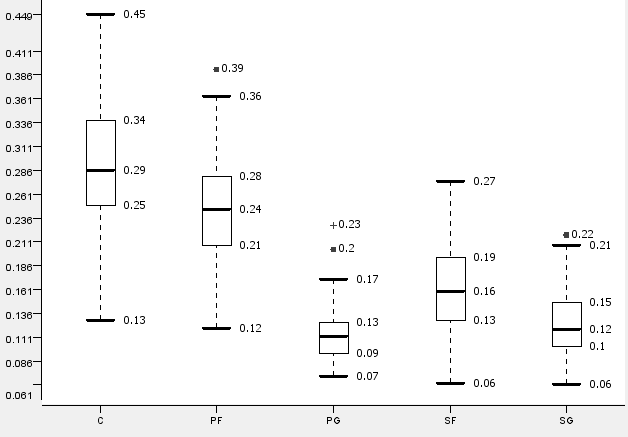

Este dato si es muy determinante, se puede observar claramente como un jugador que atrape muchos rebotes va a ser muy posiblemente pívot o ala-pívot y muy poco probable será que sea base o escolta.

##### Asistencias

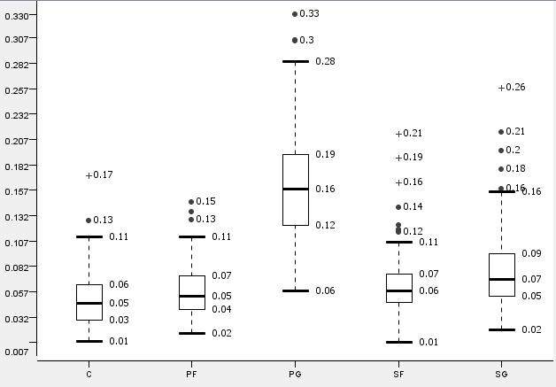

En cuanto a las asistencias el comportamiento es casi el opuesto. Los bases son los que más asistencias reparten on una diferencia considerable sobre el resto. Hay algunos casos de escoltas y aleros que reparten tanto como ellos, pero son casos aislados.

##### Robos

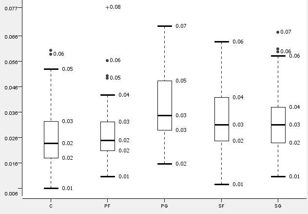

En el apartado de robos se vuelve a ver más equilibrio pero con dominio de los bases seguidos de aleros y escoltas.

##### Pérdidas

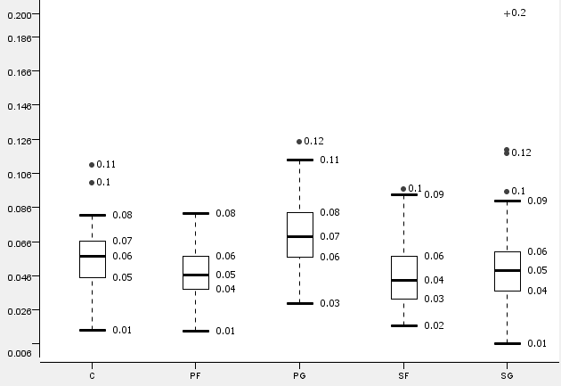

En las pérdidas también hay un ligero dominio de los bases. El resto de posiciones apenas difieren.

##### Bloqueos

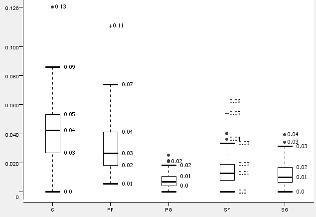

En los bloqueos el comportamiento es similar al de los rebotes con dominio de las posiciones que juegan en la pintura (pívots y ala pívots).

##### Faltas personales

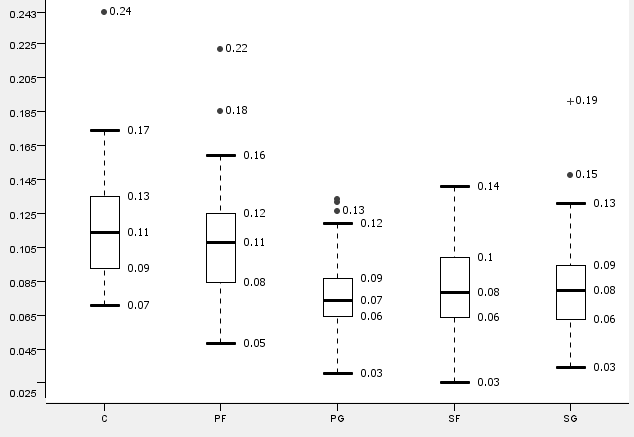

Las faltas personales también parecen ser cometidas más por los hombres grandes (pívots y ala pívots) pero no con una diferencia considerable.

##### Descalificaciones

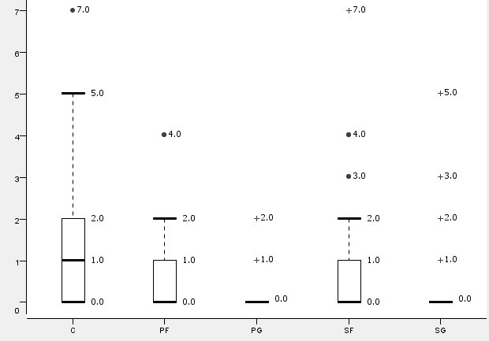

Al haber pocas descalificaciones a lo largo de la temporada no es un dato muy relevante a la hora de caracterizar una posición pero se ve como los pívot son los que más aportan en este dato.

##### Puntos

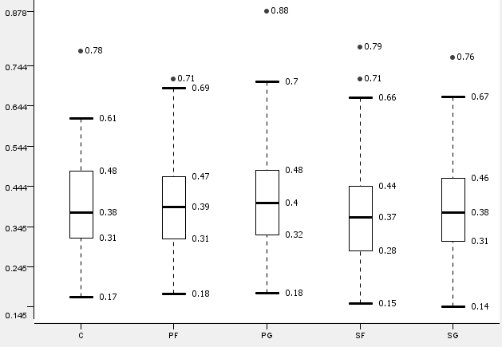

En los puntos la diferencia tampoco es significativa entre posiciones comportándose casi por igual

##### Faltas técnicas

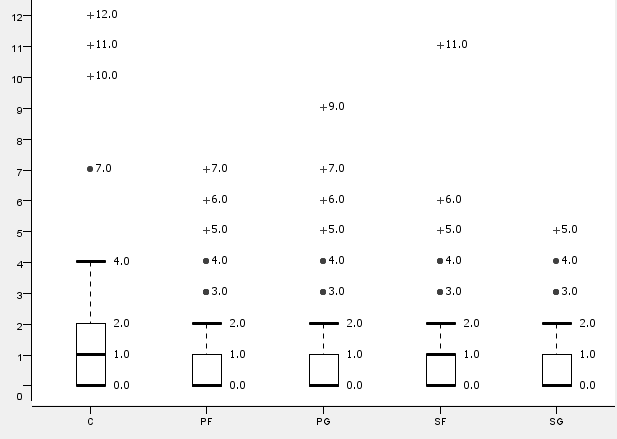

Con las faltas técnicas pasa algo parecido a lo que pasa con las descalificaciones, al haber tan pocas no va a influir mucho a la hora de caracterizar una posición y más viendo como hay un reparto equilibrado con los pocos datos que hay.

**RESUMEN INFLUENCIAS:**

* Base:
  * Muy positivas: Asistencias, robos
  * Positivas: Tiros libres anotados, porcentaje tiros libres, pérdidas
  * Negativas: -
  * Muy negativas: Rebotes, bloqueos
* Escolta:
  * Muy positivas: -
  * Positivas: Porcentaje tiros de tres
  * Negativas: Rebotes
  * Muy negativas: -
* Alero:
  * Muy positivas: -
  * Positivas: -
  * Negativas: -
  * Muy negativas: -
* Ala pívot:
  * Muy positivas: Rebotes, bloqueos
  * Positivas: Faltas personales
  * Negativas: Tiros de 3 anotados, porcentaje tiros de 3
  * Muy negativas: -
* Pívot:
  * Muy positivas: Rebotes, bloqueos
  * Positivas: Faltas personales, descalificaciones
  * Negativas: Porcentaje tiros de 3, porcentaje tiros libres
  * Muy negativas: Tiros de tres anotados

No se ha encontrado ningún atributo determinante para el alero y es que es una posición muy polivalente que aporta algo en todos los aspectos del juego.

#### Diagrama de dispersión

Directamente con los datos del *dataset* se ha asignado un color a cada posición:

 * Base: Cyan
 * Escolta: Verde
 * Alero: Amarillo
 * Ala-pívot: Magenta
 * Pívot: Rojo

A continuación se ha realizado un *scatter plot* interactivo para poder comparar varias variables:

##### Relación Equipo y +/-

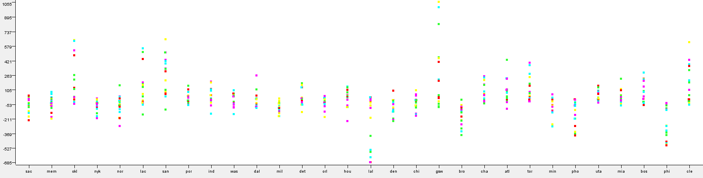

Con este gráfico se puede ver claramente quién fue el mejor equipo, ya que es el que acumula el mejor ratio puntos a favor/en contra. El mejor equipo es Golden State Warriors (GSW), con una diferencia considerable sobre Cleveland Cavalieres (CLE), San Antonio Spurs (SAN), Oklahoma-City Thunder (OKL) y Los Ángeles Clippers (LAC). Los peores serían Los Ángeles Lakers (LAL), seguido de cerca por Philadelphia 76ers (PHI) y con algo de diferencia sobre Phoenix Suns (PHO) y Brooklin Nets (BRO).

##### Asistencias y robos

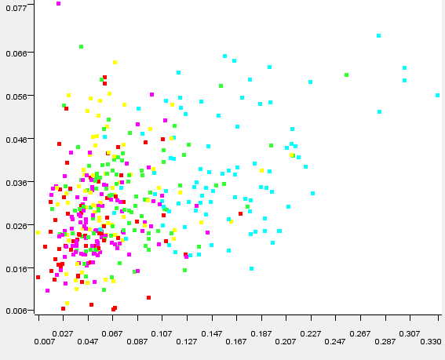

Previamente vimos que las asistencias y los robos eran las características positivas más determinantes de los bases y vemos en este gráfico de dispersión como efectivamente se cumple.

##### Rebotes y bloqueos

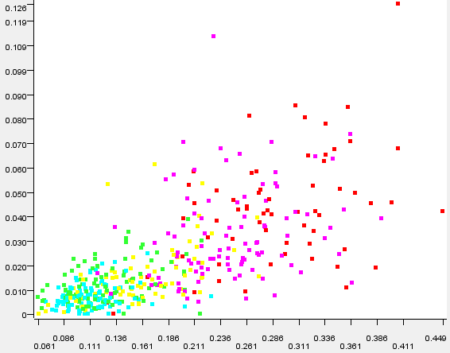

Al igual que las asistencias y los robos eran las características positivas más influyentes para los bases, para los pívots y ala pívots lo eran los rebotes y bloqueos y vemos que incluso se diferencia mejor el grupo que con asistencias y robos.

### Agrupamiento

Como hemos visto, hay cinco posiciones en el baloncesto, pero algunas de ellas se intercambian durante el partido y un mismo jugador puede jugar en varias posiciones durante una temporada por lo que dividir en tres posiciones puede resultar una tarea muy complicada. Por tanto, vamos a intentar agrupar en tres (las mismas tres en las que a veces se agrupan en algunas webs en lugar de las tres tradicionales):

* *Guard*: Juegan por fuera. Suelen ser los más bajos y agrupa a bases y escoltas aunque algunos aleros a veces ejercen esta función.
* *Center*: Juegan por dentro. Suelen ser los más altos y agrupa a pívots y ala pívots aunque algunos aleros a veces ejercen esta función.
* *Forward*: Realizan tareas mixtas, juegan tanto por fuera como por dentro por lo que suelen ser muy polivalentes. Agrupan a jugadores de cualquier posición, pero principalmente aleros y algunos escoltas y ala pívots.

Por tanto, esperamos que al realizar un agrupamiento no haya ningún base en el grupo de *center* ni un pívot en el grupo de *guard*.

#### K-medias

El primer método de agrupamiento que vamos a utilizar es el método de las k-medias usando el nodo *k-Means* de KNIME, usando el *dataset* modificado con estadísticas por minutos y utilizando las variables que vimos que eran más determinantes para definir una posición: tiros de tres anotados y su porcentaje de acierto, rebotes, asistencias, robos, pérdidas, bloqueos, faltas personales y descalificaciones.

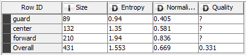

Los resultados del agrupamiento han dado una calidad de 0.331 que podría parecer baja, pero al visualizar la correspondencia posición por grupo generado nos podemos dar cuenta que los grupos generados parecen corresponderse bastante con lo predicho anteriormente. Entre los *center* están casi todos son pívots y ala pívots y la mayoría de los bases están en el grupo de los *guard*. El grupo de *forward* contiene casi todos los aleros y escoltas y algunos bases, pívots y ala pívots.

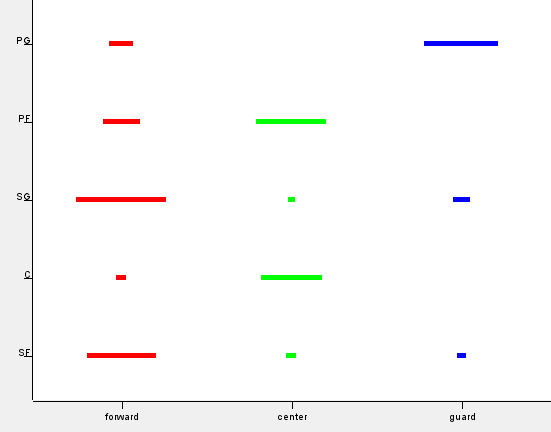

#### K-medioides

Se ha probado siguiendo el mismo enfoque que el mencionado con las k-medias el método de los k-medioides usando el nodo de KNIME *k-Medoids* usando la distancia Manhattan. El resultado ha sido similar obteniendo un ajuste de 0.306.

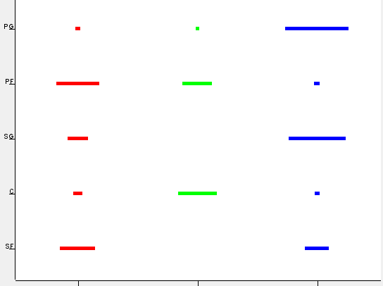

#### K-medias difusas

Siguiendo con los métodos de agrupamiento no supervisados particionales se ha probado el de las k-medias difusas usando el nodo de KNIME *Fuzzy c-Means* obteniendo un resultado similar al de las k-medias: 0.329.

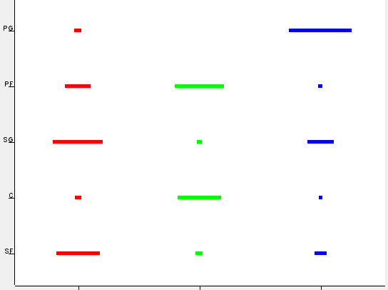

### Clasificación

A la hora de clasificar se va a intentar predecir la posición de un jugador a partir de sus datos estadísticos. Ya hemos estado discutiendo lo complicado que puede resultar por la polivalencia de algunos jugadores y por cómo algunas posiciones comparten casi los mismos atributos (sobre todo los pívot y ala-pívots).

#### Árbol de decisión

El primer enfoque que se va a realizar es utilizando un árbol de decisión usando los nodos de KNIME *Decision Tree Learner* y *Decision Tree Predictor* usando como conjunto de entrenamiento 331 valores y 100 de test. El resultado ha sido más o menos el esperado con una precisión del 58%.

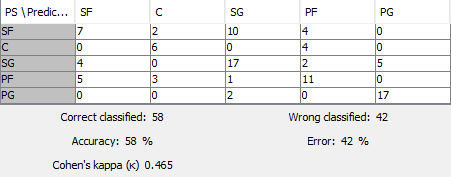

Los errores que nos encontramos son en la mayoría de las ocasiones comprensibles por su parecido con la posición equivocada. En caso de los pívot las únicas confusiones han sido con ala-pívots y en el caso de los bases casi todas las confusiones ha sido con escoltas. La posición peor clasificada ha sido la de alero ya que, como hemos indicado reiteradamente, es muy complicada de predecir por ser jugadores muy polivalentes con cualidades y estadísticas individuales muy dispares los unos de los otros.

#### *Naive-Bayes*

Tras probar el árbol de decisión pasamos a probar cómo funciona el método de *Naive-Bayes* usando los nodos de KNIME *Naive Bayes Learner* y *Naive Bayes Predictor* y haciendo el mismo particionamiento obteniendo un resultado algo mejor de un 61%.

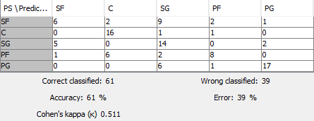

Los errores son muy similares a los obtenidos con el árbol de decisión equivocándose bastante en la posición de alero.

#### C4.5 de Quinlann

Ahora vamos a probar algunas de las técnicas de WEKA esperando obtener mejores resultados. En primer lugar probaremos el clasificador C4.5 de Quinlann usando los nodos *J48graft* y *Weka Predictor*. Usando el mismo conjunto de entrenamiento y test que en las dos técnicas anteriores se ha mejorado el resultado hasta obtener un 63%.

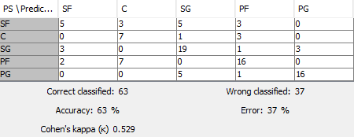

Con este clasificador se empieza a bajar el error en la posición de alero, aunque sigue sin acertar ni el 50% de estos.

#### *Random forest*

Siguiendo con técnicas de WEKA pasamos a usar *Random forest* usando los nodos *RandomForest* y *Weka Predictor*. Los resultados han sido incluso mejores que los que se han obtenido con el C4.5 de Quinlann alcanzando un 68%.

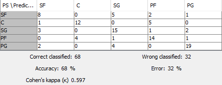

Con este clasificador se obtienen estos porcentajes de acierto por posición:

* Base: 76% (escolta: 16% y 8% alero)
* Escolta: 71.43% (alero: 14.29%, 9,52% base y 4.76% ala-pívot)
* Alero: 50% (31.25% escolta, 12.5% ala-pívot y 6.25% base)
* Ala-pívot: 70% (20% pívot, 5% escolta y 5% base)
* Pívot: 66.67% (errores: 27.78% pívot y 5.55% alero)

Vemos que la mayoría de los fallos son con posiciones similares y posiblemente sean jugadores que incluso hayan jugado algún partido en esa posición.

### Regresión

En esta sección vamos a intentar predecir los valores de algunos datos a partir de otros. Para ello se hará uso de la matriz de correlación (nodo *Linear Correlation*) que ya se analizó por encima en la sección de pre-procesamiento y de la matriz de gráficos de dispersión (nodo *Scatter Matrix*) entre cada variable.

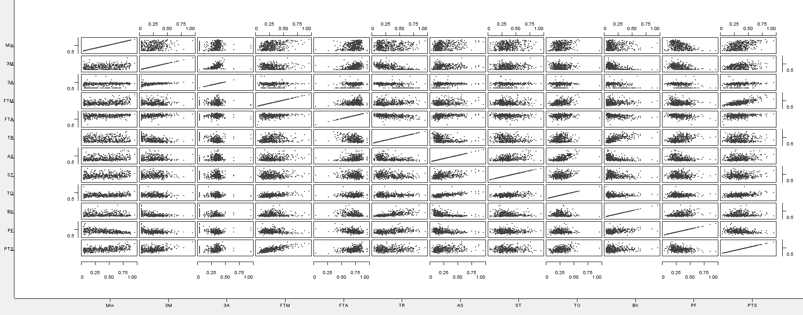

La relación entre variables no es muy alta en la mayoría de los casos. Las más altas serían:

* Puntos: Tiros libres anotados (0.7493) y minutos (0.4601)
* Asistencias: Pérdidas (0.6689) y robos (0.3773)
* Rebotes: Bloqueos (0.7024) y faltas personales (0.4474)

Por tanto vamos a intentar deducir el valor de los puntos, asistencias y rebotes usando para cada una otras dos variables. Para ello vamos a usar los nodos de KNIME *Linear Regression Learner* para crear la función de regresión y *Regression Predictor* para calcular los resultados obtenidos con esta función. Se volverá a evaluar la relación entre los valores generados y los reales para ver la calidad de la regresión.

#### Puntos

Para calcular los puntos usamos los tiros libres anotados y los minutos:

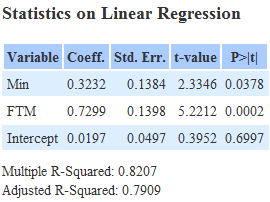

La función generada comparada con los datos de tiros libres anotados es la siguiente:

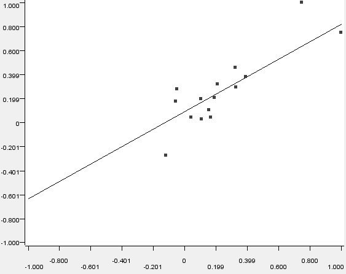

La función generada comparada con los datos de minutos es la siguiente:

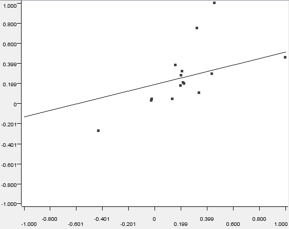

La nueva matriz de correlación es:

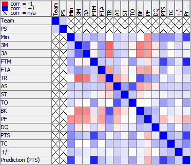

Con una correlación de:

* 0.7663 en puntos originales
* 0.8742 en tiros libres anotados
* 0.7432 en minutos

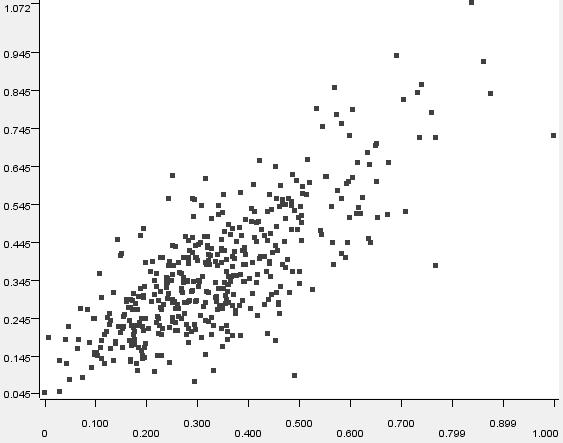

#### Asistencias

Para calcular los puntos usamos las pérdidas y los robos:

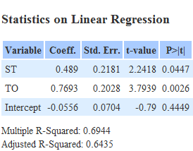

La función generada comparada con los datos de pérdidas es la siguiente:

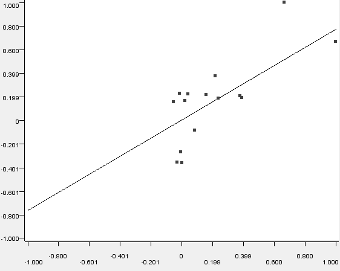

La función generada comparada con los datos de robos es la siguiente:

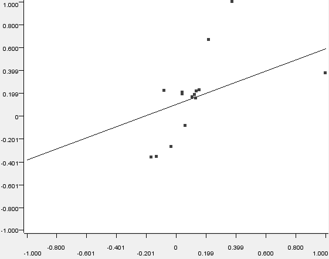

La nueva matriz de correlación es:

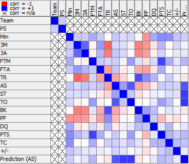

Con una correlación de:

* 0.6713 en asistencias originales
* 0.7775 en pérdidas
* 0.7835 en robos

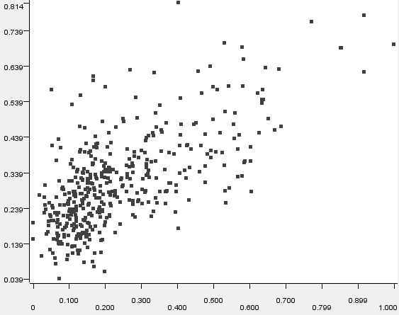

#### Rebotes

Para calcular los puntos usamos los bloqueos y las faltas personales:

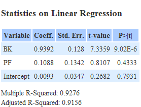

La función generada comparada con los datos de bloqueos es la siguiente:

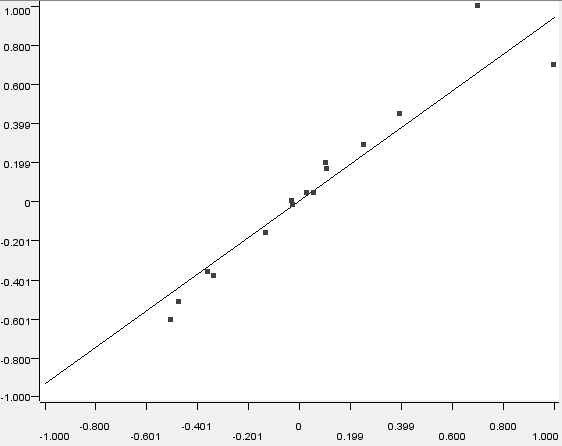

La función generada comparada con los datos de faltas personales es la siguiente:

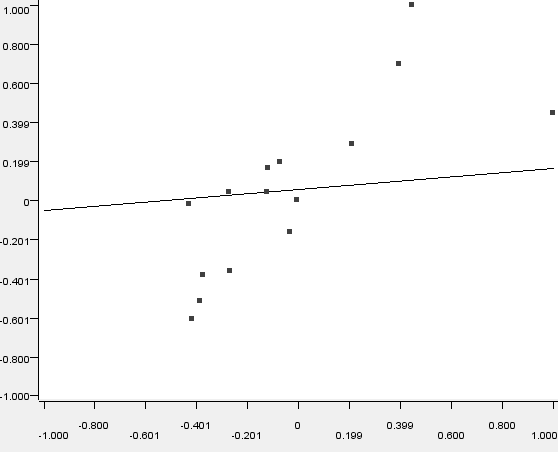

La nueva matriz de correlación es:

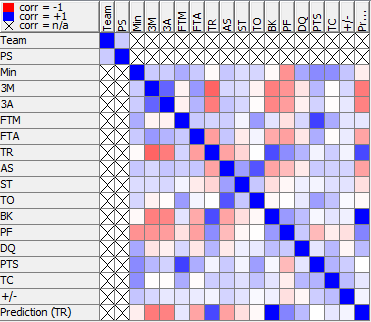

Con una correlación de:

* 0.7162 en rebotes originales
* 0.9958 en bloqueos
* 0.4806 en faltas personales

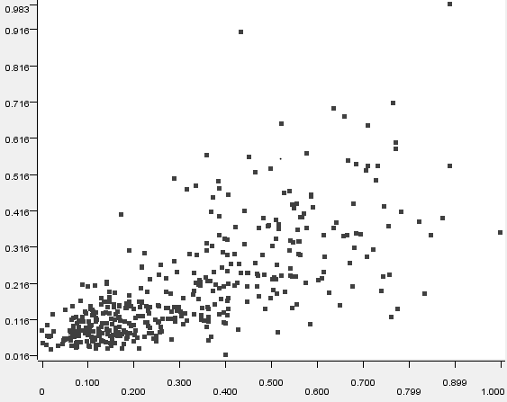

Ninguna de las variables se podría intuir con precisión a partir de otra pues la correlación que resulta con los valores originales en puntos es de 0.7663, en asistencias 0.6713 y en rebotes 0.7162, que son valores no demasiado altos. Pero es comprensible y demuestra como en el baloncesto es difícil predecir el valor de una variable a partir de otras pues las cualidades de los jugadores son muy distintas.
